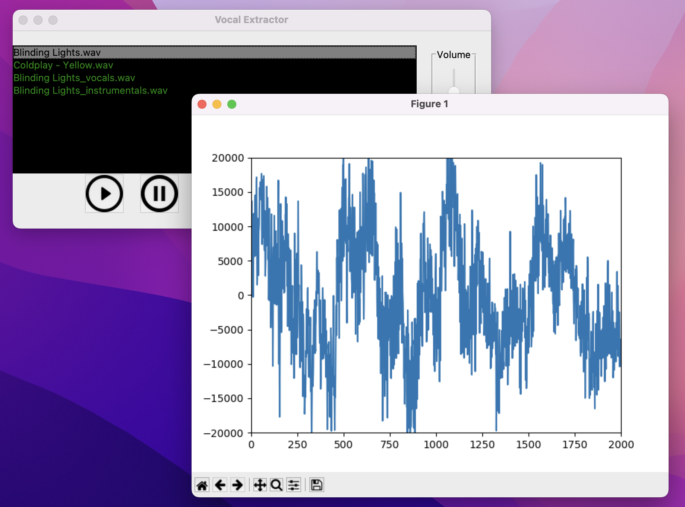
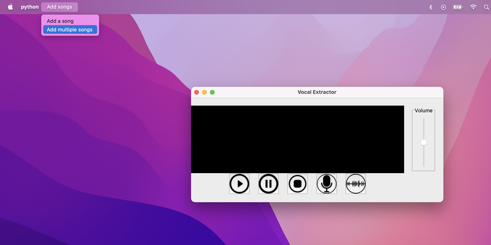
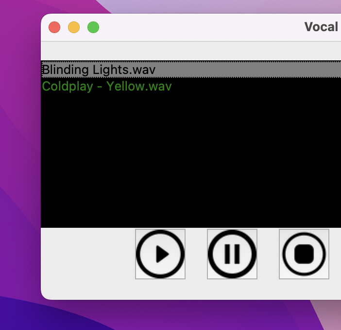
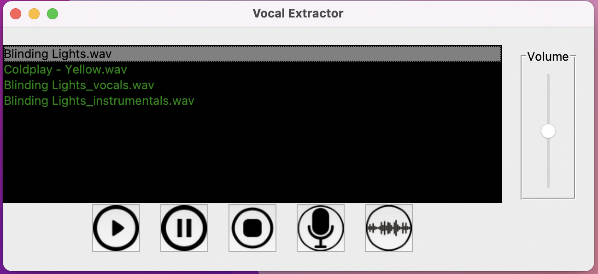
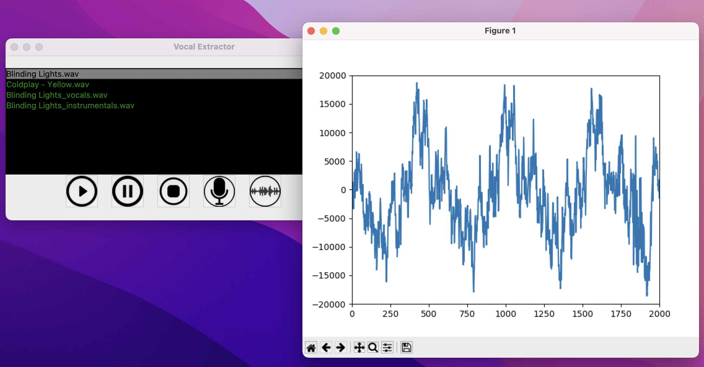

<!-- PROJECT LOGO -->
 

  

<h3 align="center">Vocal Extractor: A DSP Project</h3>
  

    Extract vocals and instrumentals of a song at the click of a button
     
    <!-- TODO update demo link -->
    <a href="https://docs.rehost.in/#/getting-started/quickstart"><strong><u>View Live Demo »</u></strong></a>
     
    <a href="mailto:si2152@nyu.edu">Siddhanth Iyer (si2152)</a>
    ·
    <a href="mailto:sv2270@nyu.edu">Shikhar Vaish (sv2270)</a>
  

    

## About The Project

This is a submission to the course Digital Signal Processing Laboratory ECE-GY 6183 as the final project. The goal was to use signal processing techniques learned in the course and build something real-life oriented out of it. The application presented here executes a predefined audio processing algorithm to extract vocal and instrumental audio signals from a song. It assumes that the input audio file provided is musical audio with human voices.

(<a href="#top">back to top</a>)

<!-- GETTING STARTED -->
## Getting Started

### Prerequisites

Dependency | Link |
--- | --- |
Python | [Official Page](https://www.python.org/downloads/)

### Installation

1. Download and extract the project zip.
2. Run the following command to install project dependencies:
`pip install -r requirements.txt`

### Run Application

1. Start the application using:
`python main.py`

(<a href="#top">back to top</a>)

## Usage

### Load Songs

    

In the application menu, go to `Add Songs > Add a song` to open the file chooser pop-up.  Select the file present on your computer to load it into the application. Intuitively, you can choose `Add Songs > Add multiple songs` to load multiple audio files.

### Audio Control

    

You can use the intuitive control buttons to play, pause, and, stop playing the songs. The slider on the right can be used to adjust the playback volume.

### Extract Vocals and Instrumentals

    

First, click on the audio track that you want to process. Next, click on the microphone icon to extract the vocals and instrumentals of the selected audio file in separate files.

It takes a few seconds to process the audio file, depending on the length of the audio track. Finally, you will see 2 new audio files saved as `<audio file name>_instrumentals.wav` and `<audio file name>_vocals.wav` in the `songs/` directory. 

These audio tracks would be loaded into the application directly after processing. You can see listen to them directly through the application.

### Real-Time Audio Visualization

    

Click the wave icon to visualize audio frequency in real-time.

## How It Works

### Audio Extraction

The application uses `librosa` library and applies 2 different softmask filters on the audio data, for instrumental and vocals respectively.

The final output is processed and saved in different files.

### Real-Time Audio Visualization

The application uses `matplotlib` and a simple sliding window algorithm to load the binary data in blocks of fix sizes. These batches are passed to `pyaudio` stream connected that plays the audio to the output device meanwhile we get matplotlib to read the audio data and plot the signals in real-time.

## Authors

* Siddhanth Iyer - si2152
* Shikhar Vaish - sv2270
